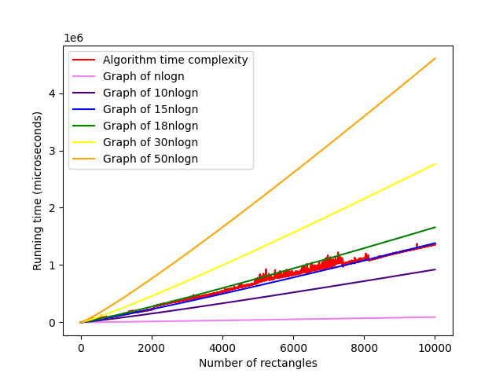
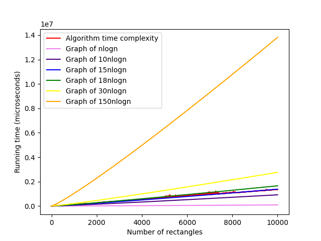

# Design and Analysis of Algorithms - Assignment 1
Implementation of the paper ["Optimal Divide-and-Conquer to Compute Measure and Contour for a Set of Iso-Rectangles"](https://link.springer.com/article/10.1007/BF00264251)

# General Discussion
- This paper aims at computing the `Measure` and `Contour` for a Set of Iso-Rectangles using a fast Divide-and-Conquer approach.
- Our `copy`, `blacken`, `concat` functions run in linear time for a corresponding `Frame` as discussed in the paper.
- We use `Iterative Depth First Search` implementation of Tree Traversal for computing the `y-contour` by gathering the leaf nodes for each `Balanced Binary Search Tree` belonging to each `Stripe`.
- For calculating the `x-contour`, we use a 2-pointer based merging operation to find the intersection of the `y-contour` with the horizontal edges.
- Hence, the calculation of both `x-contour` and `y-contour` takes O(nlogn) time.
- The `RECTANGLE_DAC` function is the driver of the `STRIPES` function. The `STRIPES` function, which calls the `copy`, `blacken`, `concat` functions, runs on log(n) levels of the divide-and-conquer tree. Thus our entire implementation runs in O(nlogn) time as discussed in the paper.

# Outputs
Conducting tests by running the algorithm for multiple testcases we could acheive a **Θ(nlogn) complexity** implementation of the algorithm.

For **c = 10, n>=1** our code runs in **O(nlogn)** complexity.

For **c1 = 10, c2 = 150, n >=1** our code runs in **Θ(nlogn)** complexity.

## Results

## Aesthetic Outputs

# Team
- G Sathyaram ["wreck-count"](https://github.com/wreck-count)
- Varun Parthasarathy ["varun-parthasarathy"](https://github.com/varun-parthasarathy)
- Siddarth Gopalakrishnan ["siddarthgopalakrishnan"](https://github.com/siddarthgopalakrishnan)
- Sivaraman Karthik Rangasai ["karthikrangasai"](https://github.com/karthikrangasai)