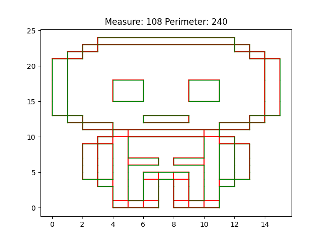
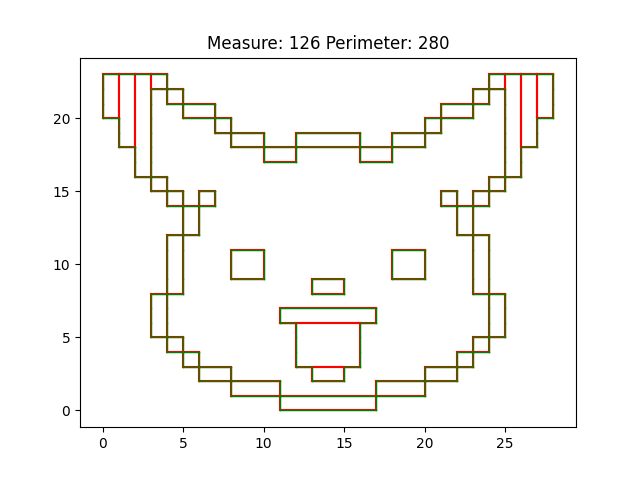

# Design and Analysis of Algorithms - Assignment 1
Implementation of the paper ["Optimal Divide-and-Conquer to Compute  Measure and Contour  for a Set of Iso-Rectangles"](https://link.springer.com/article/10.1007/BF00264251)

# Problem Description

# Outputs
Conducting tests by running the algorithm for multiple testcases we could acheive a **Θ(nlogn) complexity** implementation of the algorithm.

For **c = 10, n>=1** our code runs in **O(nlogn)** complexity.

For **c1 = 10, c2 = 150, n >=1** our code runs in **Θ(nlogn)** complexity.

## Results

## Aesthetic Outputs

# Team
- G Sathyaram ["wreck-count"](https://github.com/wreck-count)
- Varun Parthasarathy ["varun-parthasarathy"](https://github.com/varun-parthasarathy)
- Siddarth Gopalakrishnan ["siddarthgopalakrishnan"](https://github.com/siddarthgopalakrishnan)
- Sivaraman Karthik Rangasai ["karthikrangasai"](https://github.com/karthikrangasai)